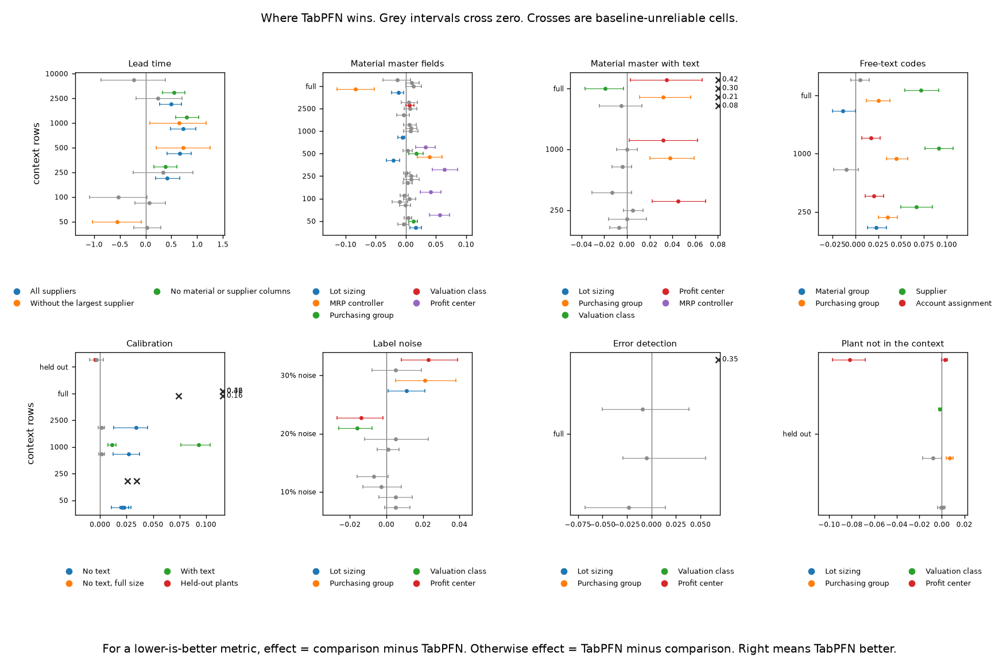
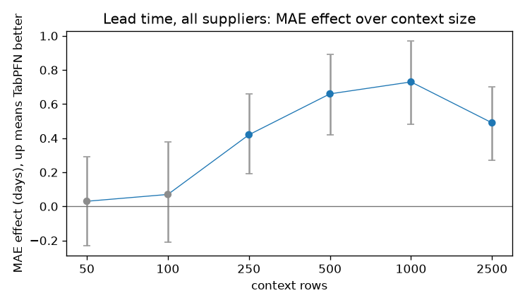
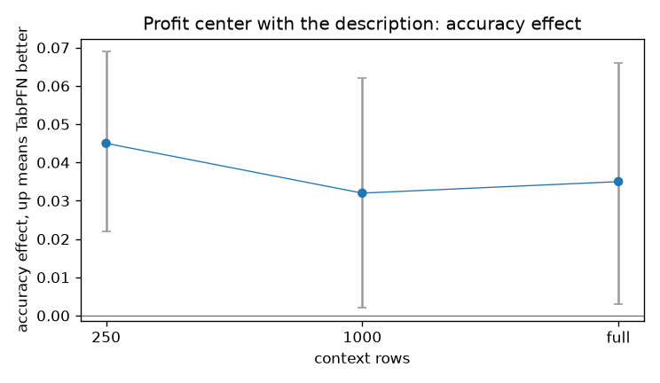
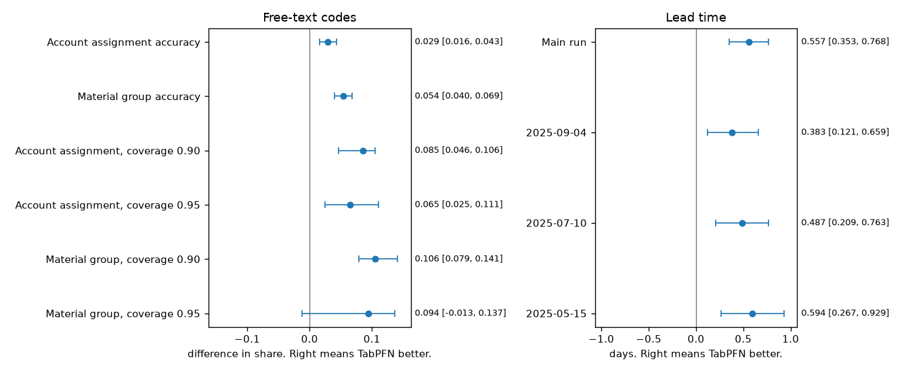
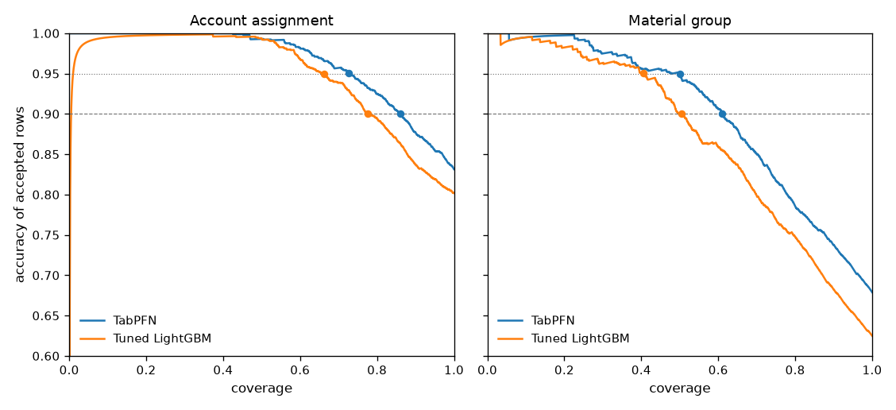
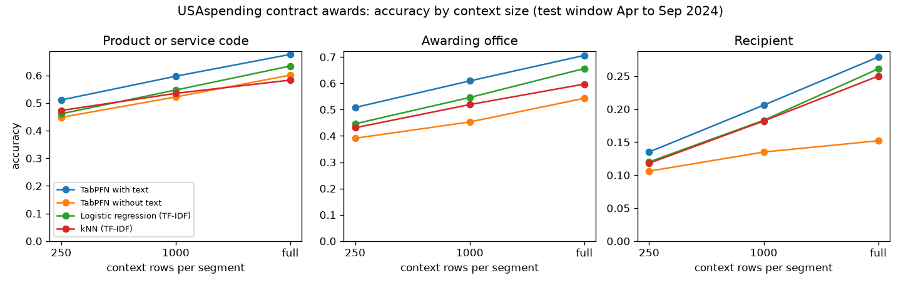
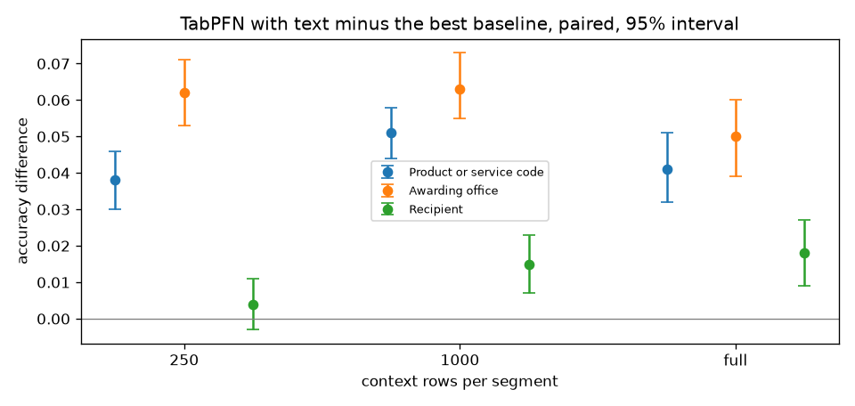
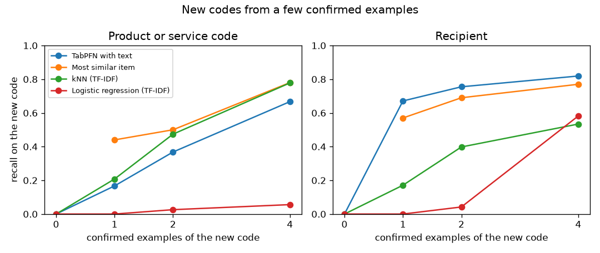

# cbs TIDE Research

## Abstract

This report consolidates the supplied experiments on procurement prediction:
delivery lead times, free-text coding, material-master fields, confidence-based
selection, and adaptation to new codes. It evaluates where TabPFN adds value
over conventional baselines, not whether every decision should use a model.

On one industrial company's SAP export, the pooled lead-time comparison reports
mean absolute error (MAE) of 5.76 days for TabPFN versus 6.32 for tuned LightGBM.
Two pooled free-text tasks also favor TabPFN. A public USAspending replication
meets its registered accuracy win rule on three tasks. Other comparisons show
no consistent advantage, and operational confidence thresholds do not reliably
transfer at their intended accuracy.

**Scope:** these are historical experiments supplied with the project, not a new
evaluation or a certification of the application currently being rebuilt.
Numerical results are transcribed from the source reports and aggregate tables.
Raw observations, prediction arrays, and evaluation runners are not included.

## Contents

- [Research questions](#research-questions)
- [Data and experimental design](#data-and-experimental-design)
- [How to read the results](#how-to-read-the-results)
- [SAP benchmarks](#sap-benchmarks)
- [Full-context evaluation](#full-context-evaluation)
- [Public replication](#public-replication)
- [Implications for the application](#implications-for-the-application)
- [Limitations and artifact review](#limitations-and-artifact-review)
- [Reproducibility and figure generation](#reproducibility-and-figure-generation)
- [Evidence inventory](#evidence-inventory)

## Research Questions

1. Does TabPFN estimate delivery lead time better than conventional models with sparse or pooled history?
2. Does text plus organizational context improve code proposals over strong text classifiers?
3. Does confidence ranking help review, and do validation-derived thresholds transfer to later requests?
4. Do findings generalize beyond the SAP export, and do confirmed examples help with unseen codes?

These are separate questions. Better average accuracy does not prove safe
automation, calibrated arrival intervals, or useful new-code adaptation.

## Data and Experimental Design

| Study                   | Population and split                                                                                                                 | Comparison                                                                                    |
| ----------------------- | ------------------------------------------------------------------------------------------------------------------------------------ | --------------------------------------------------------------------------------------------- |
| SAP benchmark families  | Two years of purchasing and master data from one industrial company's S/4HANA quality-system export; later rows held out by date     | Lead time, material-master fields, text, calibration, noise, error detection, held-out plants |
| SAP full context        | All plants pooled; 200,000 historical rows for lead time; about 27,000 earlier rows per free-text target; 2,000 test rows per target | Untuned TabPFN-3.5 versus default and tuned LightGBM                                          |
| USAspending replication | 205,586 deduplicated awards from four civilian departments, FY2023-2024; April-September 2024 held out                               | Three code targets, eight segments per task, 500 test rows per segment                        |
| Synthetic checks        | Deterministic SAP-like demo data                                                                                                     | Dataset/worklist consistency checks, not predictive performance                               |

The reports describe protocols written and SHA256-hashed before the first model
call. Some SAP comparisons are explicitly exploratory: per-plant lead time at
10,000 context rows and full-size material-master accuracy have no registered
hash. The large per-plant lead-time runs also do not record an endpoint version;
do not assume they used TabPFN-3.5.

LightGBM tuning uses Optuna. Text baselines include majority class, TF-IDF nearest
neighbors, and logistic regression. Where a best baseline is selected using test
performance, that selection favors the baselines; it is not a deployable model
selection procedure. TabPFN is evaluated without task-specific tuning.

The reported inference runtime is SAP AI Core. A public protocol originally
named another endpoint; the report records a move to SAP AI Core before model
calls, without changing the task or reading rule.

## How to Read the Results

**Context** is the historical labeled data supplied to a prediction call.
**Accuracy** is the fraction of correctly classified test rows. **MAE** is the
average absolute error of a lead-time estimate, in days.

Effects are signed so that positive means TabPFN is better: baseline minus
TabPFN for lower-is-better metrics, TabPFN minus baseline otherwise. Confidence
intervals use a paired bootstrap with 2,000 resamples, clustered where observations
belong together. Material-master text uses material clusters; free-text coding
uses purchase-order clusters; revised lead-time comparisons cluster by material,
supplier, and plant. Public comparisons cluster by parent award.

An interval crossing zero is **inconclusive**, not proof of equivalence. The
source tables call this verdict `equal`. Family-level Holm correction accounts
for multiple registered comparisons; individual figures do not automatically
display that corrected verdict. Accuracy, log loss, and other metrics can count
as separate comparisons, so win counts are not counts of independent tasks.

**Coverage at a specified accuracy** is the share of predictions retained after
ranking by confidence. In the pooled results, the threshold is chosen using test
labels: an oracle comparison of ranking quality, not an operational acceptance
rule. A threshold selected on a validation slice must be judged separately on
later requests.

**Arrival-range coverage** is different: the fraction of observed lead times
inside the predicted p10-p90 interval. Nominal coverage is 80%; observed coverage
above or below 80% is not automatically better calibration.

## SAP Benchmarks



_Figure 1. Published benchmark overview. Panels use different metrics and scales;
their effect magnitudes are not directly comparable. Grey intervals cross zero;
crosses mark unreliable baseline fits. Registered and exploratory results are
both present. Source: [benchmark table](sap-benchmarks/sap-benchmark-results.csv)._

After Holm correction within the registered families, the source reports:

| Verdict                | Comparisons |
| ---------------------- | ----------: |
| TabPFN better          |          47 |
| Inconclusive (`equal`) |          77 |
| LightGBM better        |           3 |
| Other baseline better  |           1 |
| Unreliable fits        |          11 |

Before correction, the corresponding counts are 58, 59, 8, 3, and 11.
Exploratory comparisons are excluded from those corrected counts. See
[correction and sensitivity table](sap-benchmarks/pooled-history/multiple-comparison-correction-results.csv).

### Sparse Lead-Time History



_Figure 2. Original per-plant comparison, seeds 1-3 pooled. Positive effects are
days of MAE improvement. This is not the later comparison against retuned
LightGBM and not the pooled 200,000-row design._

In that original comparison, TabPFN is ahead at 250-2,500 context rows; the
all-supplier intervals at 50 and 100 rows cross zero. At 10,000 rows per plant,
the exploratory combined MAE interval also crosses zero.

Retuning LightGBM changes the small-context interpretation. The revision covers
308 of 308 cells, uses seed 1 only, and reuses stored TabPFN predictions:

| Context rows | MAE advantage over tuned LightGBM, days | Interpretation |
| ------------ | --------------------------------------- | -------------- |
| 250          | 0.12 [-0.22, 0.45]                      | Inconclusive   |
| 1,000        | 0.50 [0.19, 0.82]                       | TabPFN ahead   |
| 2,500        | 0.35 [0.11, 0.58]                       | TabPFN ahead   |

Source: [small-context revision](sap-benchmarks/pooled-history/small-context-tuned-baseline-results.csv).

### Material-Master Fields and Text



_Figure 3. Profit-center accuracy effects in the material-text arm. The full-size
point belongs to an exploratory comparison, not an extension of the registered
small-context evidence._

Against retuned LightGBM, all four reported material-master fields favor TabPFN
at 250 rows; at 1,000 and 2,500 rows the evidence is mixed. Full-size
material-master accuracy, label noise, error detection, and rollout to an unseen
plant do not support a general superiority claim. The
[original ERP report](sap-benchmarks/sap-benchmark-report.md) retains all families and product
checks, including negative and inconclusive results.

## Full-Context Evaluation

This design pools plants instead of extending the per-plant learning curves.
The main lead-time test consists of 2,000 received items ordered on 2025-11-14.
On that date, 21.2% of eligible items still have no receipt and are not scored.



_Figure 4. Revised effects against tuned LightGBM. Free-text differences are
fractions; lead-time differences are days. Positive effects favor TabPFN._

| Target and metric                                    | TabPFN | Tuned LightGBM | Favorable effect, 95% interval |
| ---------------------------------------------------- | -----: | -------------: | ------------------------------ |
| Lead time: MAE, days                                 |   5.76 |           6.32 | 0.56 [0.35, 0.77]              |
| Account assignment: accuracy                         |  0.832 |          0.802 | 0.029 [0.016, 0.043]           |
| Material group: accuracy                             |  0.679 |          0.625 | 0.054 [0.040, 0.069]           |
| Account assignment: oracle coverage at 0.90 accuracy |  0.861 |          0.776 | 0.085 [0.046, 0.106]           |
| Material group: oracle coverage at 0.90 accuracy     |  0.611 |          0.505 | 0.106 [0.079, 0.141]           |

Values and effects are rounded separately; subtracting rounded scores can differ
from the rounded effect. The material-group revision supersedes the earlier
capped tuning run. Sources: [published results](sap-benchmarks/pooled-history/published-model-results.csv),
[reproduction](sap-benchmarks/pooled-history/reproduced-baseline-results.csv), and
[oracle coverage](sap-benchmarks/pooled-history/equal-accuracy-coverage-results.csv).



_Figure 5. Committed risk-coverage visualization. Its source curve-point CSV is
not in the supplied bundle, so this figure cannot currently be regenerated.
The summary coverage effects are available in the linked revision table._

At 95% oracle accuracy, account-assignment coverage favors TabPFN; the
material-group interval crosses zero. More importantly, the validation rule
aiming at 95% accuracy achieves only 89.8% on accepted account-assignment rows
and 92.2% on material-group rows for TabPFN. The corresponding tuned LightGBM
accuracies are 91.9% and 94.5%. These results do not establish safe 95% automation.

### Temporal Robustness and Censoring

The lead-time MAE advantage remains positive at three earlier cutoffs:

| Cutoff     | Eligible items without receipt | MAE advantage, days |
| ---------- | -----------------------------: | ------------------- |
| 2025-09-04 |                           4.9% | 0.38 [0.12, 0.66]   |
| 2025-07-10 |                           2.1% | 0.49 [0.21, 0.76]   |
| 2025-05-15 |                           1.2% | 0.59 [0.27, 0.93]   |

Each earlier test samples 2,000 received items from a 56-day window. The context
uses the 200,000 most recent eligible rows before the test window. Excluding
unreceived items omits the delivery tail and makes both models' error estimates
optimistic. These comparisons do not determine performance on that excluded tail.

On the main run, p10-p90 coverage is 87.7% versus 88.3% for tuned LightGBM.
Coverage comparisons change direction across the earlier cutoffs; lower MAE
does not establish consistently better uncertainty estimates. Sources:
[robustness results](sap-benchmarks/pooled-history/temporal-robustness-results.csv) and
[censoring shares](sap-benchmarks/pooled-history/unreceived-item-shares.csv).

### Runtime and Endpoint Limits

The main 200,000-row call took 145.9 seconds and approximately 3.5 reported cost
units. The earlier-cutoff calls took 138.0-150.5 seconds. This supports considering
batch preparation, not promising interactive latency. Cost units are not currency,
and historical measurements are not a current service-level guarantee.

The evaluated endpoint accepts at most 160 classes per request. Purchasing group
and supplier are therefore excluded from the pooled coding comparison: 99%
context coverage would require about 210 and 2,200 classes. Earlier segmented
results do not remove that pooled constraint.

LightGBM's 50-trial material-group revision took 6,249 seconds; its default fit
fell below the majority baseline and is classified as unreliable. Tuning is a
one-off expense while inference recurs; these timings are not a complete cost
comparison. [Revision notes](sap-benchmarks/pooled-history/evaluation-revision-notes.md)
record missing original tuned parameters, reproduction runs, and the material-group
rerun without the original time cap.

## Public Replication

USAspending contract awards provide a public-data check of the text result:
product/service code, awarding office, and recipient. Context sizes are 250,
1,000, and full segment history, capped at 10,000 rows. Test classes outside the
draw's top 160 count as wrong for every method.



_Figure 6. Absolute accuracy. Recipient prediction remains weak even where the
paired comparison favors TabPFN. The plot shows selected methods, not every
baseline in the table. Source: [accuracy table](usaspending/context-size-accuracy.csv)._



_Figure 7. Paired accuracy differences with 95% intervals; positive favors TabPFN.
Source: [difference table](usaspending/best-baseline-accuracy-effects.csv)._

| Task                 | 250 rows              | 1,000 rows           | Full                 |
| -------------------- | --------------------- | -------------------- | -------------------- |
| Product/service code | 0.038 [0.030, 0.046]  | 0.051 [0.044, 0.058] | 0.041 [0.032, 0.051] |
| Awarding office      | 0.062 [0.053, 0.071]  | 0.063 [0.055, 0.073] | 0.050 [0.039, 0.060] |
| Recipient            | 0.004 [-0.003, 0.011] | 0.015 [0.007, 0.023] | 0.018 [0.009, 0.027] |

The registered task-level rule requires a positive significant difference at
two or more of the three context sizes. All three tasks meet it. This public
verdict is not the SAP family-level Holm-corrected count.

Recipient accuracy is only about 14-28%; 50.7% of its test rows have classes
outside the available context classes. A statistically positive effect here is
not a useful supplier-proposal claim. The report also checks descriptions naming
recipients; removing those rows preserves the verdicts.

### Adaptation to New Codes



_Figure 8. Recall, not precision or overall utility. Source:
[new-code table](usaspending/new-code-adaptation-recall.csv)._

TabPFN meets the registered faster-adaptation rule for recipient at one and two
examples, but not for product/service code. Most recipient gains arise on
follow-up awards sharing a parent award with the confirmed example. A nearest-item
baseline added after the run narrows the advantage, and new-code precision is not
higher for TabPFN. There is no supported general claim of faster new-code learning.
See the [public source report](usaspending/replication-report.md) for the protocol
hashes, sensitivity checks, and narrow interpretation.

## Implications for the Application

| Evidence                                                    | Design implication, not a verified implementation claim                                        |
| ----------------------------------------------------------- | ---------------------------------------------------------------------------------------------- |
| Lower MAE on pooled and earlier-cutoff lead-time tests      | Evaluate forecasts for batch decision support; retain provenance and arrival-range validation. |
| Better accuracy and confidence ranking on scored text tasks | Offer inspectable proposals; calibrate the actual acceptance policy on later requests.         |
| Operational thresholds miss intended accuracy               | Do not treat raw confidence or oracle coverage as authorization for automatic action.          |
| High-cardinality classes and weak recipient performance     | Respect endpoint limits and abstain where the task is unsupported.                             |
| Mixed evidence on master fields, errors, and unseen plants  | Keep rules and historical lookups where a model has no demonstrated advantage.                 |

The ERP report's product checks also contain failed gates: delivery-date list
utility, later lead-time range checks, and combined new-material rule accuracy.
The later assistant-faithfulness check matches 10 of 15 sessions; the five misses
concern omitted rule-source attribution, not incorrect numbers. These checks
must not be silently promoted into evidence that the rebuilt workflow is ready.

## Limitations and Artifact Review

This review covers the supplied reports, CSV structure, and three plotting
scripts. It does not audit unavailable model runners or independently recompute
bootstrap intervals from predictions.

| Finding                                                                              | Consequence                                                                                                                       |
| ------------------------------------------------------------------------------------ | --------------------------------------------------------------------------------------------------------------------------------- |
| One private company/export; no CatBoost baseline or TabPFN seed-variance measurement | Generalization and the breadth of baseline superiority remain open.                                                               |
| Unreceived deliveries excluded; no censoring-aware evaluation                        | Error on the long-delivery tail is unknown.                                                                                       |
| Raw data, predictions, runner code, and original environment absent                  | Aggregate tables can be inspected, but evaluation and registration chronology cannot be independently reproduced here.            |
| Main protocol is redacted; its hash identifies the unredacted original               | Do not compare that hash with the redacted file as if they were the same document.                                                |
| Risk-coverage curve-point CSV missing                                                | The full-context script preserves the old PNG and prints a warning; a successful exit does not mean every figure was regenerated. |
| Original experiment environment absent                                               | The new plotting lockfile fixes the current rendering dependencies; it does not reconstruct the original evaluation environment.  |
| Public report refers to input manifests and threshold scripts outside this bundle    | Public data availability alone does not make this archive an executable replication package.                                      |

The full-context forest plot combines published and revised tables; use the
revision notes when reconciling values. Original detailed reports remain as
source evidence, including historical paths and product terminology. This
report is the consolidated reading entry point, not a replacement for raw results.

## Reproducibility and Figure Generation

**Available now:** inspect published aggregates and protocols; redraw seven of
the eight embedded figures from the included CSVs. **Not available:** rerun model
comparisons, reconstruct confidence intervals, or redraw the risk-coverage curve
without its missing source points. No provider credentials are needed to plot.

From the repository root, install the isolated plotting environment with `uv`.
The [project configuration](pyproject.toml) and [lockfile](uv.lock) keep plotting
dependencies separate from the application:

```sh
uv sync --project research --frozen
uv run --project research --frozen python research/sap-benchmarks/plot_sap_benchmarks.py
uv run --project research --frozen python research/sap-benchmarks/pooled-history/plot_pooled_history.py
uv run --project research --frozen python research/usaspending/plot_usaspending.py
```

These commands overwrite PNGs beside the scripts. The lockfile records the new
rendering environment, not the unavailable original model-evaluation environment;
pixel-identical output to the historical figures is not promised. The full-context
command warns and retains the existing risk-coverage PNG because the curve-point
CSV is missing. Do not use that exit status alone as a complete regeneration check.

The robustness protocol is supplied unchanged and can be checked locally:

```sh
sha256sum research/sap-benchmarks/pooled-history/temporal-robustness-protocol.md
```

Compare the output with
[the recorded hash](sap-benchmarks/pooled-history/temporal-robustness-protocol.sha256).
A matching hash establishes byte integrity, not when the protocol was registered.
The other [recorded hash](sap-benchmarks/pooled-history/evaluation-protocol-original.sha256) identifies
the unredacted main protocol, which is not included.

## Evidence Inventory

| Artifact                                                                                                                                                          | Purpose                                                                                 |
| ----------------------------------------------------------------------------------------------------------------------------------------------------------------- | --------------------------------------------------------------------------------------- |
| [ERP report](sap-benchmarks/sap-benchmark-report.md) and [results](sap-benchmarks/sap-benchmark-results.csv)                                                      | Detailed benchmark families, product checks, protocol identifiers, and original effects |
| [Redacted pooled protocol](sap-benchmarks/pooled-history/evaluation-protocol-redacted.md)                                                                         | Main design, metrics, split, and reading rule                                           |
| [Pooled results](sap-benchmarks/pooled-history/published-model-results.csv)                                                                                       | Published model scores and initial effects                                              |
| [Revision notes](sap-benchmarks/pooled-history/evaluation-revision-notes.md)                                                                                      | Declared reproduction and tuning changes                                                |
| [Reproduction table](sap-benchmarks/pooled-history/reproduced-baseline-results.csv)                                                                               | Revised scores, effects, tuning time, and operational threshold results                 |
| [Coverage table](sap-benchmarks/pooled-history/equal-accuracy-coverage-results.csv)                                                                               | Oracle equal-accuracy effects and ranking comparisons                                   |
| [Small-context table](sap-benchmarks/pooled-history/small-context-tuned-baseline-results.csv)                                                                     | Tuned-baseline comparisons and cell coverage                                            |
| [Holm table](sap-benchmarks/pooled-history/multiple-comparison-correction-results.csv)                                                                            | Multiple-comparison counts and clustered sensitivities                                  |
| [Robustness protocol](sap-benchmarks/pooled-history/temporal-robustness-protocol.md) and [results](sap-benchmarks/pooled-history/temporal-robustness-results.csv) | Earlier-cutoff evaluation                                                               |
| [Censoring table](sap-benchmarks/pooled-history/unreceived-item-shares.csv)                                                                                       | Shares excluded for lacking a receipt                                                   |
| [Worklist revision](sap-benchmarks/pooled-history/same-count-worklist-comparison.csv)                                                                             | Same-count lookup-ladder comparison                                                     |
| [Public report](usaspending/replication-report.md) and [differences](usaspending/best-baseline-accuracy-effects.csv)                                              | Replication and new-code interpretation                                                 |

Plotting sources: [ERP](sap-benchmarks/plot_sap_benchmarks.py),
[full context](sap-benchmarks/pooled-history/plot_pooled_history.py), and
[public replication](usaspending/plot_usaspending.py). Confidential customer extracts are not
included. Public source attribution is recorded in the USAspending report;
availability of these artifacts does not establish rights for other project data.
